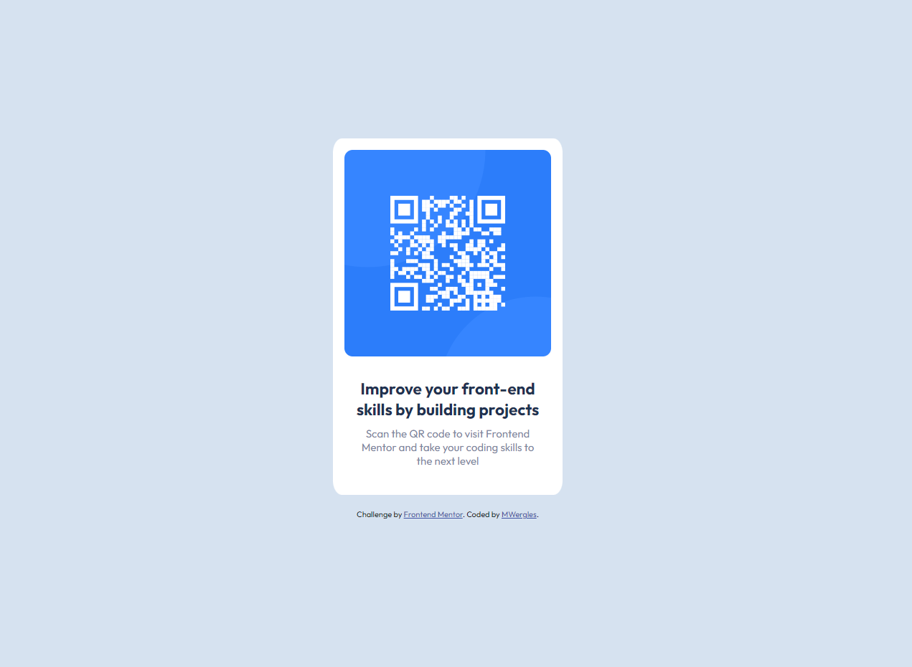

# Frontend Mentor - QR code component solution

This is a solution to the [QR code component challenge on Frontend Mentor](https://www.frontendmentor.io/challenges/qr-code-component-iux_sIO_H). Frontend Mentor challenges help you improve your coding skills by building realistic projects. 

## Overview

### Screenshot

### Links

- Solution URL: [https://github.com/mwergles/qr-code-component](https://github.com/mwergles/qr-code-component)
- Live Site URL: [https://mwergles.github.io/qr-code-component/](https://mwergles.github.io/qr-code-component/)

## My process

### Built with

- Semantic HTML5 markup
- CSS custom properties
- Flexbox

## Author

- Frontend Mentor - [@mwergles](https://www.frontendmentor.io/profile/mwergles)
